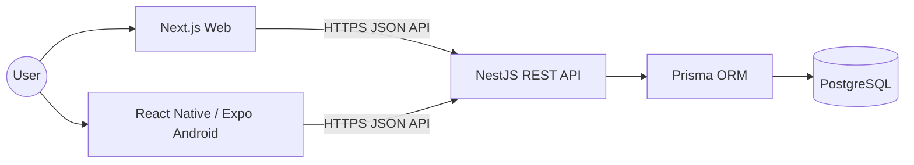
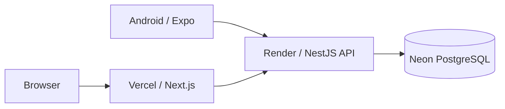
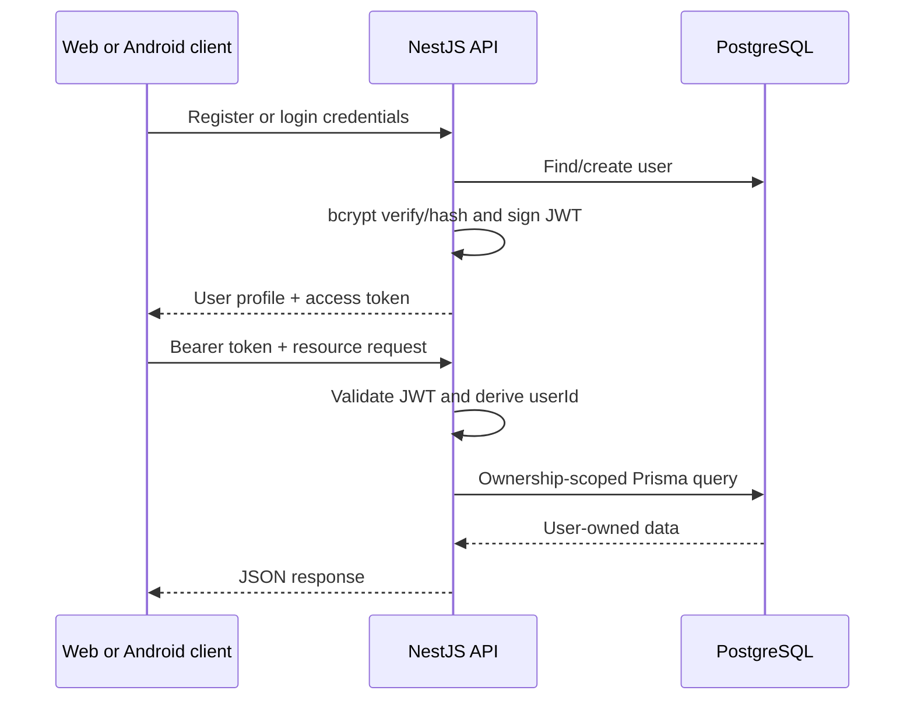

# Orbit Architecture

This document describes the deployed Orbit architecture and its security boundaries. It reflects the current implementation rather than the historical delivery plan.

## System Context

Orbit has two clients and one backend:

The web and Android applications use the same API, JWT identity model, business rules, and PostgreSQL database. Neither client talks directly to the database.

## Production Topology

| Boundary | Runtime | Responsibility |
| --- | --- | --- |
| Web | Vercel | Builds and serves the Next.js client |
| API | Render | Runs the NestJS process and Prisma database access |
| Database | Neon | Hosts the production PostgreSQL database |
| Android | Expo / React Native | Runs on the user's device and calls the deployed API |

Provider secrets hold production connection strings and signing material. The repository contains only sanitized environment templates.

## Request Flow

1. A client sends JSON over HTTPS to an `/api` endpoint.
2. Helmet applies response security headers and CORS evaluates the configured web origin.
3. NestJS throttling, authentication guards, and the global validation pipe evaluate the request.
4. Controllers pass normalized input and the JWT-derived user identifier to domain services.
5. Services scope Prisma operations by ownership and apply transaction rules where needed.
6. Prisma issues parameterized PostgreSQL operations.
7. The response is serialized; operational logs record request metadata without credentials.

## Authentication and Authorization Flow

- Password hashes use bcrypt with cost factor 12.
- Password DTOs enforce the 72 UTF-8 byte bcrypt boundary.
- Private resource routes require a verified JWT.
- `userId` is derived from the authenticated principal, not accepted as a resource-ownership field from the client.
- Project and task lookups constrain results through the authenticated user's ownership chain.
- Logout is stateless: the server confirms the operation and the client discards its access token.

## Application Boundaries

### Web

The Next.js App Router client uses TanStack Query for server state. The access token is held in `sessionStorage`; unauthorized API responses clear the session and return the user to authentication.

### Android

The Expo Router client uses TanStack Query and stores its access token in Expo SecureStore with device-only protection. Network errors are represented separately from API responses so screens can show offline recovery and retry controls.

### API

NestJS owns authentication, validation, authorization, domain transitions, and response contracts. A strict global validation pipe rejects non-whitelisted properties. Swagger publishes the HTTP contract.

### Data

Prisma is the only application database layer. The relational chain is `User → Project → Task`; foreign keys and cascading deletes enforce parent-child integrity. Project and task mutations that require read/modify/write consistency run at `Serializable` isolation with bounded retries for recognized transaction conflicts.

## Shared Contracts

The monorepo includes:

- `@orbit/types` for shared domain and transport types.
- `@orbit/validation` for reusable validation behavior.

These packages reduce drift between the API, web, and Android applications. Backend DTO validation remains authoritative at the trust boundary.

## Reliability and Observability

- Prisma migrations are versioned under `apps/api/prisma/migrations`.
- List queries add an `id` tie-breaker for deterministic pagination.
- Task state transitions maintain `completedAt` consistently.
- The health endpoint verifies both the API process and database connectivity.
- Request logging records method, URL, status, and duration.
- Error sanitization redacts tokens, credentials, password hashes, database URLs, and secret-like fields.
- API integration tests require a dedicated test database and refuse known development or production targets.

## Related Documentation

- [API reference](api.md)
- [ER diagram](er-diagram.md)
- [Historical implementation plan](implementation.md)
- [Security model](../SECURITY.md)
