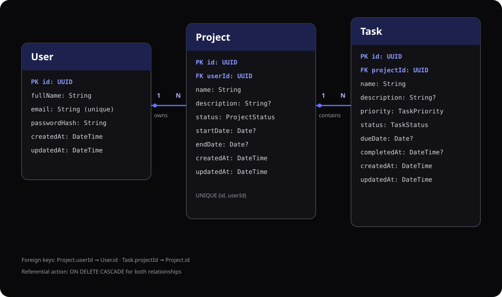

# Orbit Entity-Relationship Diagram

The model below is generated from `apps/api/prisma/schema.prisma`. `User` owns projects, and each project owns tasks. Both relationships use database-level cascading deletes.

## Relationships

- One `User` has zero or more `Project` records through `Project.userId`.
- One `Project` has zero or more `Task` records through `Task.projectId`.
- Deleting a user cascades to that user's projects; deleting a project cascades to its tasks.
- Project ownership is reinforced by a composite uniqueness constraint on `(id, userId)`.
