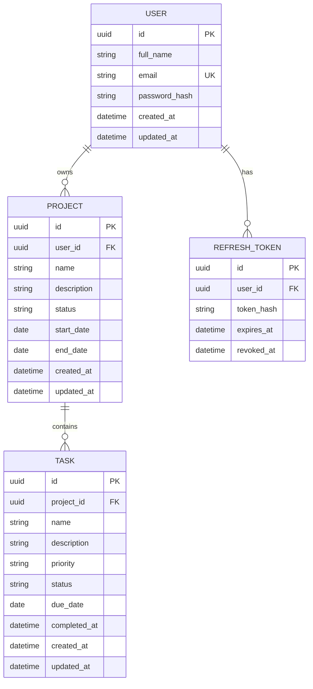

# ISMO Bio-Photonics Full Stack Developer Assessment
# Complete Implementation Plan

## Project Name

**Orbit — Cross-Platform Project & Task Management System**

---

## 1. Objective

Build a secure, maintainable, cross-platform project management system with:

- A responsive web application
- An Android mobile application
- A single shared backend
- A single shared PostgreSQL database
- Shared authentication across web and mobile
- Project management
- Task management
- Search and filtering
- User-specific dashboard statistics
- Secure authorization and data isolation
- API documentation
- Database schema documentation
- Deployment
- Android distribution
- Automated testing
- Developer-friendly setup documentation

The final product must demonstrate strong full-stack engineering fundamentals rather than simply provide CRUD screens.

---

# 2. Core Architecture

```text
                           USER
                            │
                ┌───────────┴───────────┐
                │                       │
                ▼                       ▼
          WEB APPLICATION         ANDROID APPLICATION
              Next.js              React Native Expo
                │                       │
                └───────────┬───────────┘
                            │
                       HTTPS / REST
                            │
                     ┌──────▼──────┐
                     │  NestJS API │
                     ├─────────────┤
                     │ Auth        │
                     │ Projects    │
                     │ Tasks       │
                     │ Dashboard   │
                     └──────┬──────┘
                            │
                         Prisma
                            │
                     ┌──────▼──────┐
                     │ PostgreSQL  │
                     └─────────────┘
```

### Architecture Rules

1. There must be **one backend only**.
2. Both web and Android must use the same REST API.
3. Both web and Android must use the same database.
4. No Firebase or Supabase should be introduced as a second backend.
5. Business rules must live in the backend, not be duplicated independently in clients.
6. Authentication and authorization must be enforced server-side.
7. Every user-owned database query must be scoped to the authenticated user.

---

# 3. Technology Stack

## Language

- TypeScript across web, backend, mobile, and shared packages

## Web Application

- Next.js
- App Router
- TypeScript
- Tailwind CSS
- shadcn/ui
- TanStack Query
- React Hook Form
- Zod

## Android Application

- React Native
- Expo
- Expo Router
- TypeScript
- TanStack Query
- React Hook Form
- Expo SecureStore

## Backend

- NestJS
- TypeScript
- Prisma ORM
- JWT authentication
- bcrypt
- Swagger / OpenAPI
- Helmet
- Rate limiting
- Request validation
- Structured logging

## Database

- PostgreSQL

## Testing

- Jest
- Supertest
- Backend integration/e2e tests
- Targeted frontend/mobile tests only where useful

## Engineering / DevOps

- pnpm workspaces
- Docker
- Docker Compose
- GitHub Actions
- `.env` based configuration

## Deployment

- Web: Vercel or equivalent
- Backend: Railway, Render, or equivalent
- Database: Managed PostgreSQL
- Android: Expo/EAS build or APK distribution

---

# 4. Repository Structure

```text
orbit-project-manager/
│
├── apps/
│   ├── api/
│   │   ├── src/
│   │   │   ├── auth/
│   │   │   ├── users/
│   │   │   ├── projects/
│   │   │   ├── tasks/
│   │   │   ├── dashboard/
│   │   │   ├── common/
│   │   │   ├── prisma/
│   │   │   ├── config/
│   │   │   └── main.ts
│   │   │
│   │   ├── prisma/
│   │   │   ├── schema.prisma
│   │   │   └── migrations/
│   │   │
│   │   └── test/
│   │
│   ├── web/
│   │   ├── app/
│   │   │   ├── (auth)/
│   │   │   │   ├── login/
│   │   │   │   └── register/
│   │   │   │
│   │   │   └── (dashboard)/
│   │   │       ├── dashboard/
│   │   │       ├── projects/
│   │   │       ├── projects/[id]/
│   │   │       └── tasks/
│   │   │
│   │   ├── components/
│   │   ├── features/
│   │   ├── hooks/
│   │   ├── lib/
│   │   ├── providers/
│   │   └── types/
│   │
│   └── mobile/
│       ├── app/
│       │   ├── (auth)/
│       │   │   ├── login.tsx
│       │   │   └── register.tsx
│       │   │
│       │   ├── (tabs)/
│       │   │   ├── index.tsx
│       │   │   ├── projects.tsx
│       │   │   └── tasks.tsx
│       │   │
│       │   └── project/
│       │       └── [id].tsx
│       │
│       ├── components/
│       ├── features/
│       ├── hooks/
│       ├── lib/
│       └── providers/
│
├── packages/
│   ├── types/
│   └── validation/
│
├── docs/
│   ├── architecture.md
│   ├── database-schema.md
│   ├── security.md
│   ├── api.md
│   └── screenshots/
│
├── docker-compose.yml
├── pnpm-workspace.yaml
├── .env.example
├── .gitignore
├── package.json
└── README.md
```

---

# 5. Scope Definition

## Mandatory Features

### Authentication

- User registration
- User login
- User logout
- Current authenticated user endpoint
- Unique email enforcement
- Password hashing
- Token-based authentication
- Persistent authenticated session until logout or expiration
- Same account usable on web and mobile

### Project Management

- Create project
- View all projects owned by current user
- View project details
- Edit project
- Delete project
- Search projects by name
- Filter projects by status

### Task Management

- Create task
- View task
- View tasks under project
- Edit task
- Delete task
- Mark task completed
- Change task status
- Change priority
- Search task by name
- Filter task by status
- Filter task by priority

### Dashboard

- Total projects
- Total tasks
- Completed tasks
- Pending tasks
- Projects in progress

### Mobile

- Register
- Login
- Logout
- View dashboard
- View projects
- View project tasks
- Create tasks
- Edit tasks
- Delete tasks
- Mark completed
- Change status
- Change priority
- Search tasks
- Filter tasks
- Pull-to-refresh
- Secure token storage
- Expired-session handling
- No-network handling

---

# 6. Explicitly Out of Scope Until Core Completion

Do not implement these before all mandatory requirements are stable:

- AI assistant
- Team chat
- File attachments
- Multi-user organizations
- Comments
- Complex RBAC
- Drag-and-drop Kanban
- Real-time WebSockets
- Billing
- Push notifications
- Complex offline synchronization
- Kubernetes
- Terraform
- Advanced analytics
- Large animation systems

---

# 7. Database Design

## User

```text
id              UUID PRIMARY KEY
full_name       VARCHAR NOT NULL
email           VARCHAR UNIQUE NOT NULL
password_hash   VARCHAR NOT NULL
created_at      TIMESTAMP NOT NULL
updated_at      TIMESTAMP NOT NULL
```

## Project

```text
id              UUID PRIMARY KEY
user_id         UUID FOREIGN KEY -> users.id
name            VARCHAR NOT NULL
description     TEXT
status          PROJECT_STATUS NOT NULL
start_date      DATE
end_date        DATE
created_at      TIMESTAMP NOT NULL
updated_at      TIMESTAMP NOT NULL
```

### Project Status

```text
NOT_STARTED
IN_PROGRESS
COMPLETED
```

## Task

```text
id              UUID PRIMARY KEY
project_id      UUID FOREIGN KEY -> projects.id
name            VARCHAR NOT NULL
description     TEXT
priority        TASK_PRIORITY NOT NULL
status          TASK_STATUS NOT NULL
due_date        DATE
completed_at    TIMESTAMP NULL
created_at      TIMESTAMP NOT NULL
updated_at      TIMESTAMP NOT NULL
```

### Task Priority

```text
LOW
MEDIUM
HIGH
```

### Task Status

```text
PENDING
IN_PROGRESS
COMPLETED
```

## Optional RefreshToken Table

```text
id              UUID PRIMARY KEY
user_id         UUID FOREIGN KEY -> users.id
token_hash      VARCHAR NOT NULL
expires_at      TIMESTAMP NOT NULL
revoked_at      TIMESTAMP NULL
created_at      TIMESTAMP NOT NULL
```

---

# 8. Relational Design



---

# 9. Backend Architecture

Use NestJS modules.

```text
AppModule
│
├── ConfigModule
├── PrismaModule
├── AuthModule
├── UsersModule
├── ProjectsModule
├── TasksModule
└── DashboardModule
```

Each domain module should contain:

```text
controller
service
module
dto/
entities or response models
```

Example:

```text
projects/
├── dto/
│   ├── create-project.dto.ts
│   ├── update-project.dto.ts
│   └── project-query.dto.ts
├── projects.controller.ts
├── projects.service.ts
└── projects.module.ts
```

---

# 10. Global Backend Configuration

Implement:

- API prefix: `/api`
- Global validation pipe
- Whitelist unknown properties
- Reject invalid DTO values
- Consistent exception handling
- Environment configuration
- Structured logging
- Helmet security headers
- CORS
- Swagger
- Health endpoint

Suggested health endpoint:

```text
GET /api/health
```

Response:

```json
{
  "status": "ok"
}
```

---

# 11. Authentication Design

## Registration Flow

```text
Client
  ↓
POST /api/auth/register
  ↓
Backend validation
  ↓
Normalize email
  ↓
Check uniqueness
  ↓
bcrypt password hash
  ↓
Create user
  ↓
Return safe user response
```

## Login Flow

```text
Client
  ↓
POST /api/auth/login
  ↓
Rate limiter
  ↓
Normalize email
  ↓
Lookup user
  ↓
bcrypt compare
  ↓
Issue access token
  ↓
Return user + token
```

## Authentication Requirements

- Never store plain text passwords
- Never return password hashes
- JWT-protect all private endpoints
- Validate token signature and expiration
- Clear client session on expiration
- Use generic authentication failure messages
- Rate-limit login attempts
- Normalize email before comparisons

---

# 12. Authorization Design

Authentication answers:

> Who is the user?

Authorization answers:

> Is this user allowed to access this resource?

Every project query must include current user ownership.

Bad:

```ts
findUnique({ where: { id } })
```

Correct concept:

```text
project.id = requestedProjectId
AND
project.user_id = authenticatedUserId
```

Every task request must verify ownership through the project:

```text
task.id = requestedTaskId
AND
task.project.user_id = authenticatedUserId
```

For task creation:

1. Receive `projectId`
2. Check that the authenticated user owns that project
3. Only then create task

This prevents IDOR/BOLA access.

---

# 13. Validation Rules

## User Registration

- Full name required
- Email required
- Valid email format
- Email normalized
- Password required
- Minimum password length
- Email unique

## Project

- Name required
- Name cannot be empty after trim
- Description optional
- Status must match enum
- Valid start date
- Valid end date
- `endDate >= startDate`

## Task

- Project ID required
- Name required
- Name cannot be empty
- Priority must match enum
- Status must match enum
- Valid due date

Validation must happen on the backend regardless of client-side validation.

---

# 14. Error Response Contract

Use a predictable error response.

Example:

```json
{
  "statusCode": 400,
  "code": "VALIDATION_ERROR",
  "message": "Validation failed",
  "errors": {
    "email": ["Invalid email address"]
  }
}
```

Suggested error categories:

```text
VALIDATION_ERROR
AUTHENTICATION_ERROR
AUTHORIZATION_ERROR
RESOURCE_NOT_FOUND
CONFLICT
RATE_LIMITED
INTERNAL_ERROR
```

---

# 15. API Contract

## Authentication

### POST `/api/auth/register`

Request:

```json
{
  "fullName": "Demo User",
  "email": "demo@example.com",
  "password": "SecurePassword123!"
}
```

Response:

```json
{
  "user": {
    "id": "uuid",
    "fullName": "Demo User",
    "email": "demo@example.com"
  },
  "accessToken": "jwt"
}
```

### POST `/api/auth/login`

Request:

```json
{
  "email": "demo@example.com",
  "password": "SecurePassword123!"
}
```

### POST `/api/auth/logout`

Revokes session/refresh token if refresh tokens are implemented.

### GET `/api/auth/me`

Returns safe current user information.

### Optional

```text
POST /api/auth/refresh
```

---

# 16. Project API

## GET `/api/projects`

Query parameters:

```text
search
status
page
limit
sortBy
sortOrder
```

Example:

```text
GET /api/projects?search=orbit&status=IN_PROGRESS&page=1&limit=20
```

Response should contain project data and optional pagination metadata.

## GET `/api/projects/:id`

Must enforce current-user ownership.

## POST `/api/projects`

Request:

```json
{
  "name": "ISMO Assessment",
  "description": "Full Stack Developer assessment project",
  "status": "IN_PROGRESS",
  "startDate": "2026-10-06",
  "endDate": "2026-10-10"
}
```

## PUT `/api/projects/:id`

Must validate ownership before update.

## DELETE `/api/projects/:id`

Must validate ownership before delete.

Decide and document dependent-task behavior.

Recommended:

- Cascade-delete tasks when project is deleted

---

# 17. Task API

## GET `/api/tasks`

Query parameters:

```text
projectId
search
status
priority
page
limit
sortBy
sortOrder
```

Example:

```text
GET /api/tasks?projectId=uuid&status=IN_PROGRESS&priority=HIGH
```

## GET `/api/tasks/:id`

Must verify task belongs to current user through project ownership.

## POST `/api/tasks`

Request:

```json
{
  "projectId": "uuid",
  "name": "Implement Secure Authentication",
  "description": "JWT and ownership enforcement",
  "priority": "HIGH",
  "status": "IN_PROGRESS",
  "dueDate": "2026-10-08"
}
```

Before creation:

```text
verify authenticated user owns project
```

## PUT `/api/tasks/:id`

Update task fields.

If status becomes:

```text
COMPLETED
```

set:

```text
completedAt = current timestamp
```

If moved away from completed:

```text
completedAt = null
```

## DELETE `/api/tasks/:id`

Require ownership validation.

---

# 18. Dashboard API

## GET `/api/dashboard`

Return:

```json
{
  "totalProjects": 6,
  "totalTasks": 25,
  "completedTasks": 15,
  "pendingTasks": 7,
  "projectsInProgress": 3
}
```

Every aggregate must use only records owned by the authenticated user.

Optional display-only enhancements:

- Upcoming tasks
- Project completion percentages
- Recent projects

Do not replace required metrics.

---

# 19. Search and Filtering

## Projects

Search:

```text
name contains search string
```

Filter:

```text
status
```

## Tasks

Search:

```text
name contains search string
```

Filters:

```text
project
status
priority
```

Recommended implementation:

- Perform search/filtering at backend/database level
- Do not load all data and filter only on the client

---

# 20. Pagination and Sorting

Recommended bonus implementation.

Example request:

```text
GET /api/tasks?page=1&limit=20&sortBy=dueDate&sortOrder=asc
```

Example response:

```json
{
  "items": [],
  "pagination": {
    "page": 1,
    "limit": 20,
    "total": 52,
    "totalPages": 3
  }
}
```

Allowed sort fields should be explicitly whitelisted.

Do not directly trust arbitrary database column names from query input.

---

# 21. Web Application Design

## Authentication Pages

### `/login`

Fields:

- Email
- Password

States:

- Validation
- Loading
- Invalid credentials
- Network error

### `/register`

Fields:

- Full name
- Email
- Password
- Confirm password

---

# 22. Protected Web Layout

Suggested desktop structure:

```text
┌──────────────────────────────────────────────────────────┐
│ Orbit            Search                    User Profile │
├────────────┬─────────────────────────────────────────────┤
│ Dashboard  │                                             │
│ Projects   │                CONTENT                      │
│ Tasks      │                                             │
│            │                                             │
└────────────┴─────────────────────────────────────────────┘
```

Navigation:

- Dashboard
- Projects
- Tasks
- Logout

---

# 23. Web Dashboard

Display five mandatory cards:

```text
Total Projects
Total Tasks
Completed Tasks
Pending Tasks
Projects In Progress
```

Additional sections:

- Recent projects
- Project completion
- Upcoming tasks

Keep charts lightweight or avoid them.

Prioritize readability over decoration.

---

# 24. Projects Web Screen

Toolbar:

```text
Search projects
Status filter
Sort
Create project
```

Display:

- Project name
- Status
- Start/end dates
- Number of tasks
- Completion percentage
- Quick actions

Support:

- Create project
- Edit project
- Delete project
- Open project details

---

# 25. Project Detail Screen

Display:

- Project name
- Description
- Status
- Dates
- Progress
- Task statistics
- Task list

Actions:

- Edit project
- Delete project
- Create task

Task controls:

- Search
- Status filter
- Priority filter
- Edit
- Complete
- Delete

---

# 26. Tasks Web Screen

Provide a user-wide task list.

Filters:

```text
Search
Project
Status
Priority
Sort
```

Display:

- Task name
- Project
- Priority
- Status
- Due date
- Completion state

---

# 27. Web UX Requirements

Every data-driven screen must implement:

- Loading state
- Empty state
- Error state
- Success state

Forms must:

- Validate client-side
- Display backend errors
- Disable submit while submitting
- Prevent double submission

Destructive operations:

- Require confirmation

---

# 28. Web State Management

Use TanStack Query for:

- Projects
- Tasks
- Dashboard
- Current user

Use mutations for:

- Create
- Update
- Delete

On successful mutation:

- Invalidate affected query keys
- Refetch dashboard when task/project status affects statistics

Do not create unnecessary global state.

---

# 29. Mobile Application Structure

## Authentication Stack

- Login
- Register

## Main Tabs

- Dashboard
- Projects
- Tasks

## Additional Screens

- Project details
- Create task
- Edit task

---

# 30. Mobile Authentication

Use Expo SecureStore for authentication credentials.

Never store access credentials in plain local storage.

Mobile startup flow:

```text
Open app
  ↓
Read secure token
  ↓
No token → Login
  ↓
Token exists → GET /api/auth/me
  ↓
Valid → App
  ↓
Expired/invalid → clear token → Login
```

---

# 31. Mobile Dashboard

Display:

- Total projects
- Total tasks
- Completed tasks
- Pending tasks
- Projects in progress

Keep mobile layout compact.

---

# 32. Mobile Projects

Project list should support:

- View all projects
- Refresh
- Open details

Project detail:

- Project metadata
- Progress
- Tasks under project

---

# 33. Mobile Task Features

Required:

- View tasks
- Create task
- Edit task
- Delete task
- Mark complete
- Change status
- Change priority
- Search
- Status filter
- Priority filter

---

# 34. Pull-to-Refresh

Use standard mobile refresh control.

Expected flow:

```text
User pulls down
  ↓
Refetch relevant query
  ↓
Display latest server state
```

This is sufficient for cross-platform consistency.

Do not introduce WebSockets unless required later.

---

# 35. Mobile Offline Handling

When API cannot be reached:

```text
You're offline.
Check your internet connection and try again.

[Retry]
```

Requirements:

- Do not crash
- Do not show blank screen
- Preserve navigation
- Allow retry

Optional bonus:

- Show last cached task list read-only

---

# 36. Expired Session Handling

When API returns expired/invalid auth:

1. Clear secure token
2. Clear authenticated query cache
3. Navigate to login
4. Display:

```text
Your session has expired.
Please log in again.
```

---

# 37. Cross-Platform Synchronization

No separate synchronization service is necessary.

Example:

```text
Web creates task
       ↓
NestJS API
       ↓
PostgreSQL
       ↓
Mobile pull-to-refresh
       ↓
GET /api/tasks
       ↓
New task appears
```

Reverse:

```text
Mobile completes task
       ↓
PUT /api/tasks/:id
       ↓
PostgreSQL
       ↓
Web refetch/refresh
       ↓
Updated status and dashboard
```

---

# 38. Security Implementation

## Password Security

- bcrypt
- Salted password hash
- Never log password
- Never return password hash

## JWT Security

- Strong secret from environment
- Token expiration
- Guard protected routes
- Reject expired/invalid token

## Authorization

- Every project query scoped to authenticated user
- Every task query scoped through project ownership

## Input Security

- DTO validation
- Reject invalid enums
- Reject invalid dates
- Trim required strings
- Ignore/reject unexpected properties

## Database Security

- Prisma-generated queries
- Avoid raw SQL
- Never concatenate user input into SQL

## Rate Limiting

Apply stronger rate limiting to:

```text
/api/auth/register
/api/auth/login
```

## HTTP Security

- Helmet
- HTTPS in production
- Restrictive CORS
- No sensitive headers returned

## Secrets

- `.env` excluded from Git
- `.env.example` contains placeholders only
- Deployment secrets stored in platform secret manager/environment

## Mobile Security

- SecureStore for tokens
- No secrets embedded in source
- API URL is not a secret

---

# 39. CORS Strategy

Local development:

```text
http://localhost:<web-port>
```

Production:

```text
https://<deployed-web-domain>
```

Do not leave production CORS as unrestricted `*` when authenticated browser clients are involved.

---

# 40. Logging

Log:

- Request method
- Path
- Status code
- Duration
- Server errors

Do not log:

- Password
- Raw JWT
- Secrets
- Sensitive credentials

---

# 41. API Documentation

Use Swagger.

Recommended endpoint:

```text
/api/docs
```

Document:

- Request DTOs
- Response objects
- Authentication requirement
- Query parameters
- Error responses

README should link to deployed Swagger documentation.

---

# 42. Automated Testing Strategy

Prioritize meaningful tests.

## Authentication

- Registration works
- Duplicate email rejected
- Invalid email rejected
- Incorrect password rejected
- Private endpoint rejects no token
- Invalid token rejected

## Authorization

Create:

```text
User A
User B
```

Test:

```text
B cannot GET A project
B cannot PUT A project
B cannot DELETE A project

B cannot GET A task
B cannot PUT A task
B cannot DELETE A task

B cannot create a task inside A project
```

## Project Validation

- Empty name rejected
- Invalid status rejected
- End date before start date rejected

## Task Validation

- Empty name rejected
- Invalid priority rejected
- Invalid status rejected
- Foreign project rejected

## Dashboard

- Only current-user records included
- Counts update after task completion

---

# 43. Docker

Recommended once core functionality is stable.

## API Dockerfile

Build NestJS production application.

## Web Dockerfile

Build Next.js production application.

## Docker Compose

Suggested local stack:

```text
postgres
api
web
```

Docker should not become a blocker for local development.

---

# 44. CI/CD

Add GitHub Actions.

Suggested pipeline:

```text
checkout
  ↓
setup Node/pnpm
  ↓
install
  ↓
lint
  ↓
typecheck
  ↓
test
  ↓
build
```

The workflow should fail on real build/test errors.

Do not suppress failures merely to show a green badge.

---

# 45. Deployment Architecture

```text
                         INTERNET
                            │
             ┌──────────────┴──────────────┐
             │                             │
             ▼                             ▼
        Vercel Web                  Expo Android App
             │                             │
             └──────────────┬──────────────┘
                            │
                       HTTPS REST
                            │
                       NestJS API
                            │
                         Prisma
                            │
                    Managed PostgreSQL
```

---

# 46. Deployment Order

Recommended:

1. Provision managed PostgreSQL
2. Deploy NestJS backend
3. Run production migrations
4. Verify health endpoint
5. Verify Swagger
6. Verify authentication
7. Deploy Next.js
8. Configure production CORS
9. Point mobile app at deployed API
10. Build Android distribution
11. Test cross-platform data flow

---

# 47. Deployment Environment Variables

Example backend:

```text
DATABASE_URL=
JWT_SECRET=
JWT_EXPIRES_IN=
REFRESH_TOKEN_SECRET=
WEB_ORIGIN=
PORT=
```

Web:

```text
NEXT_PUBLIC_API_URL=
```

Mobile:

```text
EXPO_PUBLIC_API_URL=
```

Do not commit production values.

---

# 48. Documentation Requirements

## README

Must contain:

```text
# Orbit

## Overview
## Live Demo
## Features
## Architecture
## Tech Stack
## Repository Structure
## Database Schema
## ER Diagram
## API Documentation
## Local Development
## Environment Variables
## Running the Backend
## Running the Web App
## Running the Android App
## Testing
## Security
## Docker
## CI/CD
## Deployment
## Demo Credentials
## Screenshots
## Design Decisions
## Known Limitations
```

---

# 49. Architecture Documentation

Create:

```text
docs/architecture.md
```

Explain:

- Why single backend
- Why NestJS
- Why PostgreSQL
- Why Prisma
- Why TypeScript everywhere
- Web/mobile API sharing
- Query ownership design
- Deployment architecture

---

# 50. Security Documentation

Create:

```text
docs/security.md
```

Explain:

- Password hashing
- JWT
- Authorization
- IDOR/BOLA prevention
- Validation
- ORM parameterization
- Rate limiting
- CORS
- SecureStore
- Secret handling

Avoid claiming the system is perfectly secure.

Document implemented controls honestly.

---

# 51. Database Documentation

Create:

```text
docs/database-schema.md
```

Include:

- Entities
- Fields
- Foreign keys
- Enum values
- Delete behavior
- ER diagram

---

# 52. Git Strategy

Use meaningful commits.

Example:

```text
chore: initialize full-stack monorepo

feat(api): configure postgres and prisma

feat(auth): implement secure JWT authentication

feat(projects): implement project CRUD and filtering

feat(tasks): implement task management and search

feat(dashboard): add authenticated dashboard metrics

fix(security): enforce project and task ownership

feat(web): build responsive project management interface

feat(mobile): implement Android task management

test(api): add authorization integration tests

ci: add GitHub Actions pipeline

docs: add architecture and security documentation

chore: configure production deployment
```

Avoid meaningless commit names.

---

# 53. UI Design Principles

The interface should feel like a professional SaaS application.

Use:

- Neutral surfaces
- Strong typography hierarchy
- One main accent color
- Consistent 8px spacing rhythm
- Subtle borders
- Consistent radius
- Compact information density
- Clear states
- Responsive layouts

Avoid:

- Excessive gradients
- AI-style blob graphics
- Overuse of glassmorphism
- Huge empty cards
- Decorative animation that delays interactions
- Too many colors

---

# 54. Web Dashboard Concept

```text
┌───────────────────────────────────────────────────────────┐
│ Orbit           Search                         User      │
├─────────────┬─────────────────────────────────────────────┤
│ Dashboard   │ Good evening                              │
│ Projects    │                                           │
│ Tasks       │  Projects   Tasks   Complete   Pending    │
│             │     6        25       15         7        │
│             │                                           │
│             │ Project Progress                          │
│             │ ISMO Assessment       ████████░ 82%      │
│             │ LearnTwin             ██████░░░ 65%      │
│             │                                           │
│             │ Upcoming Tasks                            │
│             │ Secure Auth       HIGH      Tomorrow      │
│             │ API Docs          MEDIUM    Oct 09        │
└─────────────┴─────────────────────────────────────────────┘
```

---

# 55. Mobile UI Concept

```text
┌──────────────────────────┐
│ Orbit                    │
│                          │
│ Good evening             │
│                          │
│ Projects       Tasks     │
│    6             25      │
│                          │
│ Completed      Pending   │
│    15             7      │
│                          │
│ Recent Tasks             │
│                          │
│ Secure Auth       HIGH   │
│ Tomorrow                 │
│                          │
│ API Docs        MEDIUM   │
│ Oct 09                   │
│                          │
├──────────────────────────┤
│ Home   Projects   Tasks  │
└──────────────────────────┘
```

---

# 56. Demo Data

Create realistic test-only demo data.

Example projects:

```text
ISMO Assessment
Mobile Application
Research Dashboard
Portfolio Website
```

Example tasks:

```text
Implement Authentication
Design Database Schema
Build Dashboard API
Create Android UI
Write API Documentation
Configure Deployment
```

Never use real personal data.

---

# 57. Cross-Platform Acceptance Scenario

This is the primary product demo.

## Web

Log in.

Create:

```text
Project:
ISMO Assessment

Status:
IN_PROGRESS
```

Create task:

```text
Implement Secure Authentication
Priority: HIGH
Status: IN_PROGRESS
```

## Mobile

Log in using the same account.

Pull-to-refresh.

The task must appear.

Change the task to:

```text
COMPLETED
```

## Web

Refresh.

Expected:

- Task shows Completed
- Completed-task statistic increases
- Project progress updates

---

# 58. Final Functional Acceptance Checklist

## Authentication

- [ ] Registration works
- [ ] Duplicate email blocked
- [ ] Login works
- [ ] Wrong password blocked
- [ ] Logout works
- [ ] `/me` works
- [ ] Private APIs reject missing auth

## Projects

- [ ] Create
- [ ] List
- [ ] Details
- [ ] Edit
- [ ] Delete
- [ ] Search
- [ ] Status filter

## Tasks

- [ ] Create
- [ ] List
- [ ] Details
- [ ] Edit
- [ ] Delete
- [ ] Complete
- [ ] Search
- [ ] Status filter
- [ ] Priority filter

## Dashboard

- [ ] Total projects
- [ ] Total tasks
- [ ] Completed tasks
- [ ] Pending tasks
- [ ] Projects in progress
- [ ] User isolation

## Mobile

- [ ] Android launches
- [ ] Same user account
- [ ] Secure token storage
- [ ] Dashboard
- [ ] Projects
- [ ] Project tasks
- [ ] Task CRUD
- [ ] Search/filter
- [ ] Pull-to-refresh
- [ ] Offline state
- [ ] Expired-session state

## Security

- [ ] bcrypt
- [ ] JWT
- [ ] Protected endpoints
- [ ] Ownership checks
- [ ] Validation
- [ ] Rate limiting
- [ ] ORM-safe queries
- [ ] Restricted CORS
- [ ] Secrets excluded from Git

## Documentation

- [ ] README
- [ ] `.env.example`
- [ ] ER diagram
- [ ] API docs
- [ ] Database setup
- [ ] Mobile setup
- [ ] Security docs
- [ ] Architecture docs

## Deployment

- [ ] Web URL
- [ ] Backend URL
- [ ] Database migration applied
- [ ] Swagger reachable
- [ ] Android APK/Expo link
- [ ] Cross-platform production test

---

# 59. Bonus Priority

Only after mandatory functionality is complete.

## High-Value Bonuses

1. Pagination
2. Sorting
3. Automated authorization tests
4. Docker
5. GitHub Actions CI
6. Shared TypeScript types
7. Refresh tokens

## Lower-Priority Bonuses

- Audit logs
- Offline read-only cache

## Avoid Unless Everything Else Is Complete

- RBAC
- Push notifications
- Advanced offline synchronization

---

# 60. AI-Assisted Development Rules

When using coding agents:

1. Give one implementation phase at a time.
2. Require inspection before modification.
3. Do not allow agents to redesign working architecture.
4. Require exact changed-file reports.
5. Require build/typecheck/test after each task.
6. Preserve API contracts.
7. Do not let an agent introduce another backend.
8. Do not allow hidden shortcuts such as client-only authorization.
9. Require explicit blocker reporting.
10. Review agent output before moving to the next phase.

---

# 61. AI Tool Allocation Strategy

Use high-volume coding tools for:

- Project scaffolding
- CRUD implementation
- Forms
- UI screens
- DTOs
- API clients
- Basic test boilerplate
- README drafting
- Docker files

Reserve higher-value limited coding/reasoning capacity for:

- Authentication review
- Authorization review
- IDOR/BOLA review
- Cross-platform contract review
- Difficult debugging
- Final release-blocker audit

Do not spend limited premium coding capacity on routine CSS or scaffolding.

---

# 62. Final Engineering Principles

Prioritize in this order:

```text
Correctness
↓
Security
↓
Cross-platform consistency
↓
Requirement coverage
↓
Reliability
↓
Maintainability
↓
Testing
↓
Documentation
↓
UI polish
↓
Optional bonuses
```

A smaller complete and secure application is stronger than a larger partially working application.

---

# 63. Interview Preparation Topics

Be ready to explain:

## Why NestJS?

- Modular structure
- Dependency injection
- Guards
- Validation
- Testability

## Why PostgreSQL?

- Natural relational model
- Strong foreign keys
- User → Project → Task structure

## Why Prisma?

- Type-safe ORM
- Migrations
- Parameterized query generation
- Fast development

## Why JWT?

- Works with both web and mobile REST clients

## Why backend validation?

- Clients cannot be trusted

## Why secure mobile storage?

- Authentication tokens are credentials

## How is SQL injection reduced?

- ORM-generated parameterized queries
- No string concatenation with user input

## How is cross-user access prevented?

- Every resource query is scoped to authenticated user ownership

## How do web and mobile synchronize?

- Same backend/database
- Query refetch after changes
- Pull-to-refresh on mobile

## Why no WebSockets?

- Refresh-based synchronization satisfies the requirement with less complexity

## Why no excessive bonus features?

- Core correctness, security, maintainability, and reliability were prioritized

---

# 64. Final Submission Package

The final submission should contain:

```text
PUBLIC GITHUB REPOSITORY
        │
        ├── Web source
        ├── Mobile source
        ├── Backend source
        ├── README
        ├── API documentation
        ├── ER diagram
        ├── Security documentation
        ├── Tests
        ├── Docker
        └── CI/CD

LIVE WEB APPLICATION

LIVE BACKEND API

SWAGGER API DOCUMENTATION

ANDROID APK / EXPO DISTRIBUTION

5-MINUTE DEMO VIDEO
```

---

# 65. Definition of Done

The project is complete when:

1. All mandatory web features work.
2. All mandatory mobile features work.
3. Both clients use the same deployed backend.
4. Both clients see the same data.
5. Users cannot access each other's resources.
6. Authentication and validation are enforced by the backend.
7. Required dashboard statistics are correct.
8. Search and filtering work.
9. Mobile handles offline and expired sessions cleanly.
10. The live deployment is reachable.
11. Android distribution is usable.
12. Swagger documentation is available.
13. README setup can be followed by another developer.
14. ER diagram is included.
15. No secrets are committed.
16. High-value automated tests pass.
17. The cross-platform demo flow works reliably.
18. The public repository is ready for evaluator review.

---

# 66. Final Submission Story

The project should communicate:

> Orbit is a secure cross-platform project management system built with a shared NestJS REST API and PostgreSQL database. The Next.js web client and React Native Android client use the same authenticated user account and the same project/task data. The implementation emphasizes backend validation, ownership authorization, clear API contracts, maintainable architecture, testing, documentation, deployment, and reproducible engineering practices.

That is the standard the implementation should maintain from the first commit to the final submission.
